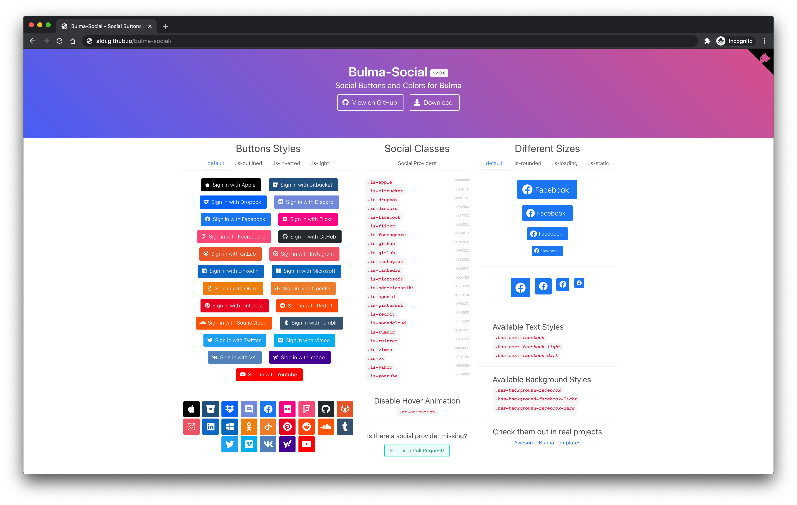

# Bulma-Social

Social Buttons and Colors for [Bulma](http://bulma.io/)

[](https://npmjs.com/package/bulma-social)
[](https://www.jsdelivr.com/package/npm/bulma-social)
[](https://awesome.re)

[Check out the live demo!](http://aldi.github.io/bulma-social)



## Installation

### NPM

```sh
npm install bulma-social
```

or

### Yarn

```sh
yarn add bulma-social
```

After installation, you can import the CSS files into your project using these commands:

Import all social providers:

```js
import "bulma-social/css/all.min.css";
```

or import certain social providers:

```js
import "bulma-social/css/single/apple/apple.min.css";
```

### CDN

[https://www.jsdelivr.com/package/npm/bulma-social](https://www.jsdelivr.com/package/npm/bulma-social)

Link all social providers:

```html
<link
  rel="stylesheet"
  href="https://cdn.jsdelivr.net/npm/bulma-social@2/css/all.min.css"
/>
```

or link certain social providers:

```html
<link
  rel="stylesheet"
  href="https://cdn.jsdelivr.net/npm/bulma-social@2/css/single/apple/apple.min.css"
/>
```

## Documentation

The documentation resides in the [docs](docs) directory.

Browse the [online documentation here.](https://aldi.github.io/bulma-social/index.html)

## Available Social Provider Classes

- `.is-apple`
- `.is-bitbucket`
- `.is-discord`
- `.is-dropbox`
- `.is-facebook`
- `.is-flickr`
- `.is-foursquare`
- `.is-github`
- `.is-instagram`
- `.is-linkedin`
- `.is-microsoft`
- `.is-odnoklassniki`
- `.is-openid`
- `.is-pinterest`
- `.is-reddit`
- `.is-slack`
- `.is-soundcloud`
- `.is-tumblr`
- `.is-twitter`
- `.is-vimeo`
- `.is-vk`
- `.is-yahoo`
- `.is-youtube`

## Available Styles

- `.is-outlined`
- `.is-inverted`
- `.is-light`

## Available States

- `.is-hovered` and `:hover`
- `.is-focused` and `:focus`
- `.is-active` and `:active`
- `.is-disabled` and `disabled`
- `.is-static`

## Available Text Color Styles

Replace &lt;social-provider&gt;

- `.has-text-<social-provider>`
- `.has-text-<social-provider>-light`
- `.has-text-<social-provider>-dark`

## Available Background Color Styles

Replace &lt;social-provider&gt;

- `.has-background-<social-provider>`
- `.has-background-<social-provider>-light`
- `.has-background-<social-provider>-dark`

## Examples

```html
<!-- Buttons with text -->
<a class="button is-medium is-facebook">
  <span class="icon">
    <i class="fab fa-facebook"></i>
  </span>
  <span>Facebook</span>
</a>
<a class="button is-medium is-facebook is-outlined">
  <span class="icon">
    <i class="fab fa-facebook"></i>
  </span>
  <span>Facebook</span>
</a>
<a class="button is-medium is-facebook is-light">
  <span class="icon">
    <i class="fab fa-facebook"></i>
  </span>
  <span>Facebook</span>
</a>

<!-- Icon Buttons -->
<a class="button is-medium is-facebook">
  <span class="icon">
    <i class="fab fa-facebook fa-lg"></i>
  </span>
</a>
<a class="button is-medium is-facebook is-outlined">
  <span class="icon">
    <i class="fab fa-facebook fa-lg"></i>
  </span>
</a>
<a class="button is-medium is-facebook is-light">
  <span class="icon">
    <i class="fab fa-facebook fa-lg"></i>
  </span>
</a>
<a class="button is-medium is-facebook is-inverted">
  <span class="icon">
    <i class="fab fa-facebook fa-lg"></i>
  </span>
</a>

<!-- Text Colors -->
<a class="is-size-4 has-text-facebook">Hi Facebook</a>
<a class="is-size-4 has-text-facebook-light">Hi Facebook Light</a>
<a class="is-size-4 has-text-facebook-dark">Hi Facebook Dark</a>

<!-- Background Colors -->
<div class="is-size-4 has-background-facebook has-text-white">Hi Facebook</div>
<div class="is-size-4 has-background-facebook-light">Hi Facebook Light</div>
<div class="is-size-4 has-background-facebook-dark has-text-white">
  Hi Facebook Dark
</div>
```

## Licence 📜

Code released under [the MIT license](https://github.com/aldi/bulma-social/blob/master/LICENSE).
