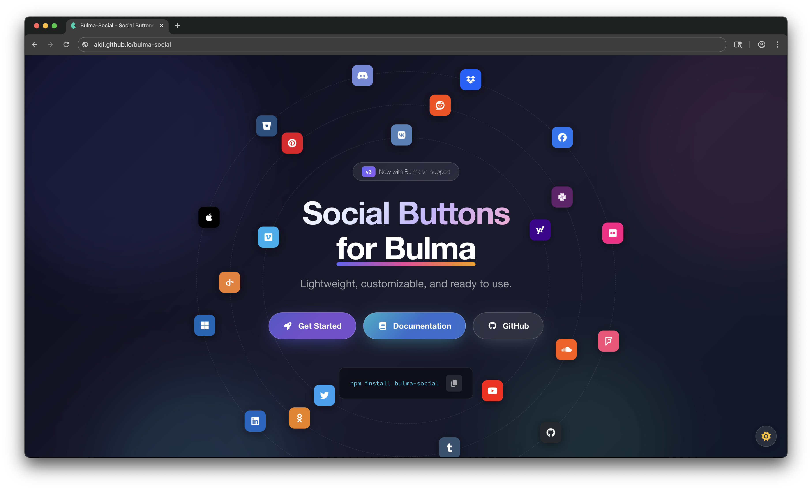

<h1 align="center">Bulma-Social</h1>

<p align="center">
  <strong>Social Buttons and Colors for <a href="https://bulma.io/">Bulma</a></strong>
</p>

<p align="center">
  <a href="https://npmjs.com/package/bulma-social"></a>
  <a href="https://www.jsdelivr.com/package/npm/bulma-social"></a>
  <a href="https://npmjs.com/package/bulma-social"></a>
  <a href="https://github.com/aldi/bulma-social/blob/master/LICENSE"></a>
  <a href="https://awesome.re"></a>
</p>

<p align="center">
  <a href="https://aldi.github.io/bulma-social/docs/providers"><strong>🎨 Live Demo</strong></a> ·
  <a href="https://aldi.github.io/bulma-social"><strong>📖 Documentation</strong></a>
</p>



## ✨ Features

- 🎨 **24 Providers** — All major social platforms included
- 🧩 **Bulma Native** — Seamlessly integrates with Bulma's class naming conventions
- 📦 **Modular Imports** — Import only what you need, keep your bundle minimal
- 🌙 **Dark Mode Ready** — Fully optimized for light and dark themes
- 🔧 **Framework Agnostic** — Works with React, Vue, Angular, Svelte, or plain HTML
- 🎯 **Any Icon Library** — Compatible with Font Awesome, Material Icons, Ionicons, and more

## 📦 Installation

Bulma-Social is an add-on stylesheet for Bulma, so **Bulma is required** (peer dependency: `bulma >= 1.0.0`).
Make sure Bulma’s CSS is loaded **before** Bulma-Social.

### NPM

```sh
npm install bulma-social
```

### Yarn

```sh
yarn add bulma-social
```

### pnpm

```sh
pnpm add bulma-social
```

After installation, import the CSS in your project:

```js
// Bulma (required)
import "bulma/css/bulma.min.css";

// Import all social providers
import "bulma-social/css/all.min.css";

// Or import specific providers for smaller bundle size
import "bulma-social/css/single/facebook/facebook.min.css";
import "bulma-social/css/single/github/github.min.css";
```

### CDN

Use via [jsDelivr](https://www.jsdelivr.com/package/npm/bulma-social) — no installation required:

```html
<!-- All social providers (~8KB minified) -->
<link
  rel="stylesheet"
  href="https://cdn.jsdelivr.net/npm/bulma-social@3/css/all.min.css"
/>

<!-- Or load specific providers -->
<link
  rel="stylesheet"
  href="https://cdn.jsdelivr.net/npm/bulma-social@3/css/single/facebook/facebook.min.css"
/>
```

---

## 🎨 Supported Social Providers

<table>
  <tr>
    <td><code>.is-apple</code></td>
    <td><code>.is-discord</code></td>
    <td><code>.is-facebook</code></td>
    <td><code>.is-github</code></td>
  </tr>
  <tr>
    <td><code>.is-gitlab</code></td>
    <td><code>.is-instagram</code></td>
    <td><code>.is-linkedin</code></td>
    <td><code>.is-microsoft</code></td>
  </tr>
  <tr>
    <td><code>.is-pinterest</code></td>
    <td><code>.is-reddit</code></td>
    <td><code>.is-slack</code></td>
    <td><code>.is-twitter</code></td>
  </tr>
  <tr>
    <td><code>.is-youtube</code></td>
    <td><code>.is-vimeo</code></td>
    <td><code>.is-dropbox</code></td>
    <td><code>.is-bitbucket</code></td>
  </tr>
  <tr>
    <td><code>.is-flickr</code></td>
    <td><code>.is-foursquare</code></td>
    <td><code>.is-odnoklassniki</code></td>
    <td><code>.is-openid</code></td>
  </tr>
  <tr>
    <td><code>.is-soundcloud</code></td>
    <td><code>.is-tumblr</code></td>
    <td><code>.is-vk</code></td>
    <td><code>.is-yahoo</code></td>
  </tr>
</table>

---

## 🎭 Button Styles & States

### Styles

| Class          | Description                        |
| -------------- | ---------------------------------- |
| `.is-outlined` | Transparent background with border |
| `.is-inverted` | Inverted colors                    |
| `.is-light`    | Light background variant           |
| `.is-dark`     | Dark background variant            |

### States

| Class / Attribute | Description    |
| ----------------- | -------------- |
| `.is-hovered`     | Hover state    |
| `.is-focused`     | Focus state    |
| `.is-active`      | Active state   |
| `.is-disabled`    | Disabled state |

---

## 🖌️ Color Utilities

### Text Colors

```html
<span class="has-text-facebook">Facebook Blue</span>
<span class="has-text-facebook-light">Facebook Light</span>
<span class="has-text-facebook-dark">Facebook Dark</span>
```

### Background Colors

```html
<div class="has-background-facebook">Facebook Background</div>
<div class="has-background-facebook-light">Light Variant</div>
<div class="has-background-facebook-dark">Dark Variant</div>
```

> 💡 Replace `facebook` with any supported provider name.

---

## 💡 Usage Examples

### Buttons with Text

```html
<a class="button is-facebook">
  <span class="icon">
    <i class="fa-brands fa-facebook"></i>
  </span>
  <span>Sign in with Facebook</span>
</a>

<a class="button is-github is-outlined">
  <span class="icon">
    <i class="fa-brands fa-github"></i>
  </span>
  <span>Continue with GitHub</span>
</a>

<a class="button is-google is-light">
  <span class="icon">
    <i class="fa-brands fa-google"></i>
  </span>
  <span>Sign in with Google</span>
</a>
```

### Icon-Only Buttons

```html
<a class="button is-facebook">
  <span class="icon"><i class="fa-brands fa-facebook fa-lg"></i></span>
</a>

<a class="button is-twitter is-outlined">
  <span class="icon"><i class="fa-brands fa-twitter fa-lg"></i></span>
</a>

<a class="button is-instagram is-inverted">
  <span class="icon"><i class="fa-brands fa-instagram fa-lg"></i></span>
</a>
```

---

## 📖 Documentation

Full documentation with interactive examples is available at:

**👉 [aldi.github.io/bulma-social](https://aldi.github.io/bulma-social)**

---

## 🤝 Contributing

Contributions are welcome! Please read our [Contributing Guide](.github/CONTRIBUTING.md) before submitting a Pull Request.

1. Fork the repository
2. Create your feature branch (`git checkout -b new-provider`)
3. Commit your changes (`git commit -m 'Add new provider'`)
4. Push to the branch (`git push origin new-provider`)
5. Open a Pull Request

---

## 📄 License

Released under the [MIT License](LICENSE).

---
