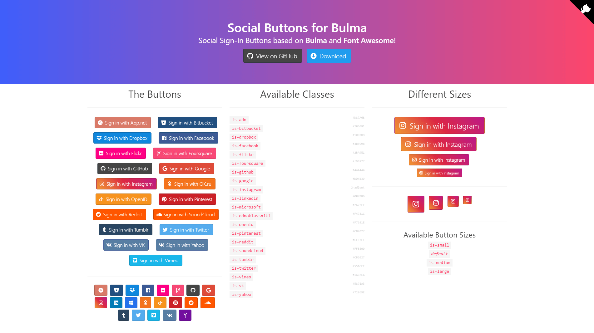

# Bulma-Social

Social Sign-In Buttons made in pure CSS based on [Bulma](http://bulma.io/) and [Font Awesome](http://fortawesome.github.io/Font-Awesome/)

[](https://npmjs.com/package/bulma-social)
[](https://awesome.re)

[Check out the live demo!](http://aldi.github.io/bulma-social)



## Installation

### NPM

```sh
npm install bulma-social
```

After installation, you can import the CSS files into your project using these commands:

```sh
import 'bulma/css/bulma.min.css';
import '@fortawesome/fontawesome-free/css/all.min.css';
import 'bulma-social/bin/bulma-social.min.css';
```

### HTML (CDN)

A typical header would look like this:

```html
<head>
<meta charset="utf-8">
<meta name="viewport" content="width=device-width, initial-scale=1.0">
<title>Social Buttons for Bulma!</title>
<!-- Bulma -->
<link rel="stylesheet" href="https://cdn.jsdelivr.net/npm/bulma@0/css/bulma.min.css">
<!-- Font Awesome 5 -->
<link rel="stylesheet" href="https://cdn.jsdelivr.net/npm/@fortawesome/fontawesome-free@5/css/all.min.css">
<!-- Bulma-Social -->
<link rel="stylesheet" href="https://cdn.jsdelivr.net/npm/bulma-social@1/bin/bulma-social.min.css">
</head>
```

## Available classes

- `is-adn`
- `is-apple`
- `is-bitbucket`
- `is-dropbox`
- `is-facebook`
- `is-flickr`
- `is-foursquare`
- `is-github`
- `is-google`
- `is-instagram`
- `is-linkedin`
- `is-microsoft`
- `is-odnoklassniki`
- `is-openid`
- `is-pinterest`
- `is-reddit`
- `is-soundcloud`
- `is-tumblr`
- `is-twitter`
- `is-vimeo`
- `is-vk`
- `is-yahoo`
- `is-youtube`

 Separate button styles for each brand: Work in progress.

## Examples

```html
<!-- Github Button -->
<a class="button is-medium is-github">
    <span class="icon">
      <i class="fab fa-github"></i>
    </span>
    <span>GitHub</span>
</a>

<!-- Github Icon Button -->
<a class="button is-medium is-github">
    <span class="icon">
      <i class="fab fa-github fa-lg"></i>
    </span>
</a>
```

## Licence 📜

Code released under [the MIT license](https://github.com/aldi/bulma-social/blob/master/LICENSE).
